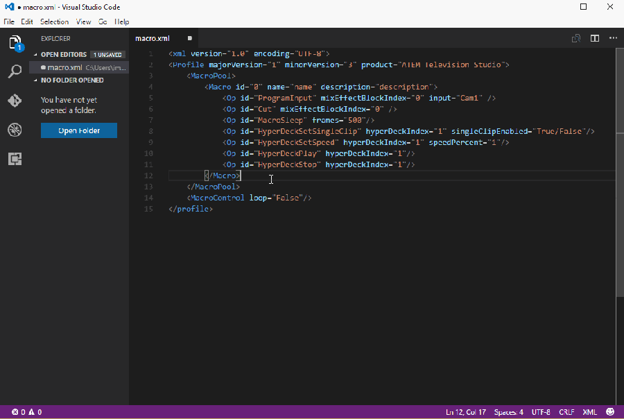

# Blackmagic ATEM Macro XML snippets

This is the snippet add-in for VS Code to create or edit macros in the ATEM XML import/export format

# Demo

## Change Log
v0.0.6 - added ATEM Constellation as a product choice.

## Usnig the snippts

- Export an ATEM configuration from the ATEM software control
- Open the XML file in VSCode and add a Maco by inserting your cursor in the MacroPool section, then type macro.
- Or create a new XML file that can be imported to the ATEM by typeing ATEM - macroprofile
- All snippets are prefixed with ATEM followed by major function (ME, DSK, USK etc)
macrosleep
PreviewInpu
ProgramInput
Cuttransition
Autotransition
DSKALL or Downstream
USK has a lot of Key, Chroma, Luma and Pattern commands
HyperDeck